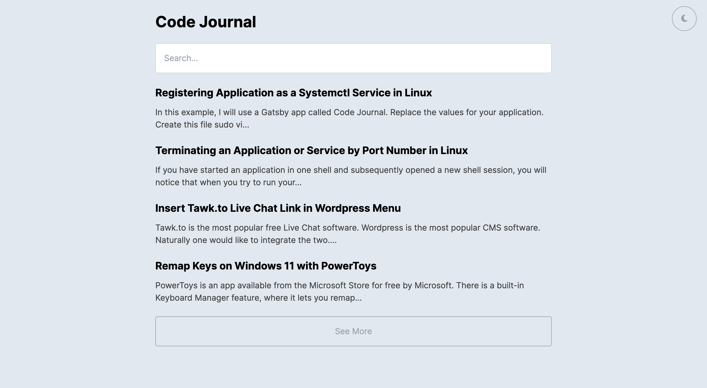
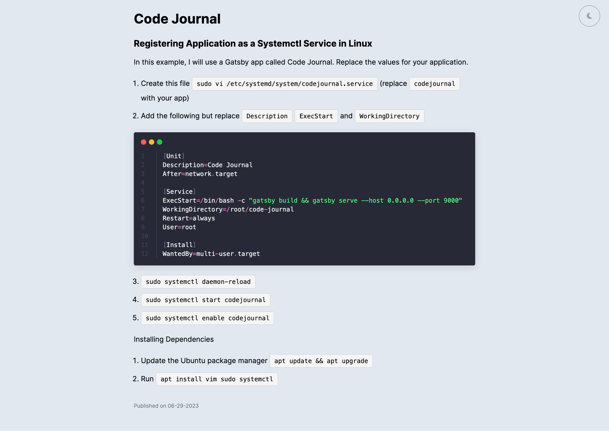

# Code Journal

### Convert Markdown Files into a Blog with Beautiful Code Highlighting

Are you tired of WordPress messing up your code when you publish it? Or do you find yourself locked out of your code journal until service is restored if your headless CMS encounters issues?

That's where Code Journal comes in. Built using Gatsby, Code Journal allows you to access your code journal at any time by opening the statically generated site or directly accessing the markdown files.





[Github Repo](https://github.com/ryanhuangio/code-journal-gatsby)

[Live Demo](https://code.ryanhuang.io)

## Provision

1. `git clone https://github.com/ryanhuangio/code-journal-gatsby.git`
2. `cd code-journal`
3. `yarn install`
4. `gatsby develop`

## Add Posts

1. Navigate to `./code-journal/src/content/`
2. Create a new markdown file in this format `YYYY-MM-DD-blog-post.md`. You can name it anything you want, as long as it is in the the content folder and is a .md file.
3. Add the "frontmatter" between --- and beneath that is your post.

```markdown
---
title: "How to Verify a Conversion Tracking Pixel"
slug: "verify-tracking-pixel"
date: "2015-02-26"
---

Markdown goes here...
```

## Deploy

1. `gatsby build && gatsby serve`


